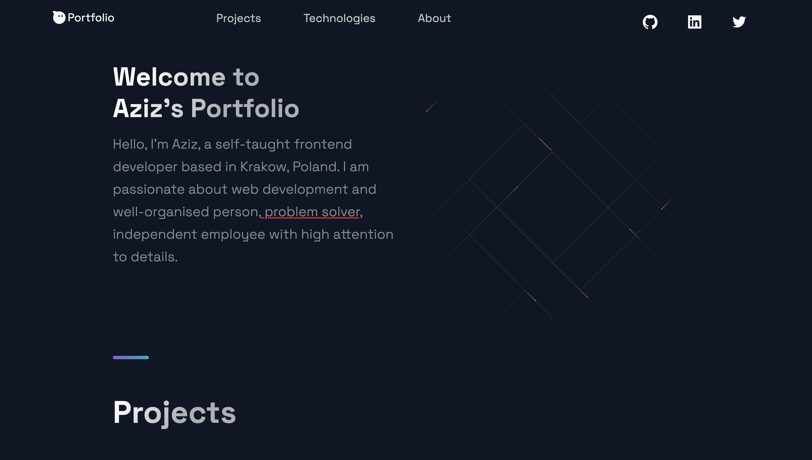

## Personal Portfolio
[Link to DEMO!](https://clonecryptoverse.netlify.app/)

It is fully functional website and showing real data about last minute crypto updates and news from RapidApi. In this application/website I have used React.js, Antd, Axios, Charct.js, Redux-Toolkit, Millify, Moment.js

# Stacks I have used
`React` `Axios` `Redux/toolkit` `Ant-design` `Chart.js`

